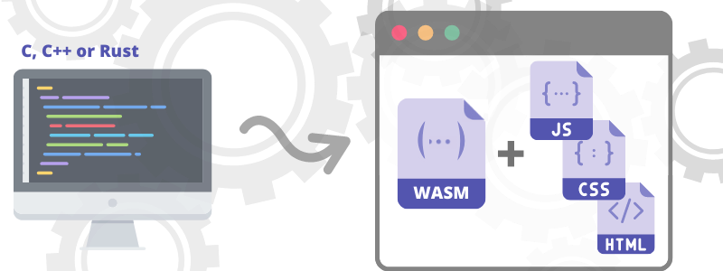

# What is WebAssembly?

WebAssembly is a binary instruction format for a stack-based virtual machine and usually abbreviated as WASM and it is designed as a portable target for compilation of high-level languages like C/C++/Rust, enabling deployment on the web for client and server applications.
 

Also in other words we can say that it is a compliment to JavaScript and a way for people to take C++, or C, or rust code,  or any other statically typed language and compile it down  to a module that you can call from JavaScript. So they work together.

<h2>Why do we need WebAssembly?</h2>

As we know that JavaScript has been the primary language that runs within the virtual machine. However, modern use-cases have illustrated one of the biggest problems with JavaScript
which is ` performance `
When running resource-intensive apps, such as 3D games, VR and augmented reality, and video editing, we see JavaScript `isn’t` capable of  delivering near-native performance.

Although WebAssembly is a completely different than JavaScript and it run alongside it. This way, developers can get a best-of-both-worlds for their applications. And, unlike JavaScript,
WebAssembly is a low-level, assembly-like language with a compact binary format. This makes it possible for WebAssembly to deliver `near-native` performance.

> With more and more cloud native, mobile-first development going on, near-native performance has become crucial for some applications to function in a way that is viable to consumers.

<h4> Here are some benefits which shows why we need WebAssembly</h4>

- <h5>WebAssembly is efficient and fast :</h5>
   Wasm bytecode is designed to be encoded in a size and load-time-efficient binary format. WebAssembly aims to execute at native speed by taking advantage of common hardware capabilities available on a wide range of platforms.

- <h5>WebAssembly is safe :</h5>
   WebAssembly describes a memory-safe, sandboxed execution environment that may even be implemented inside existing JavaScript virtual machines. When embedded in the web, WebAssembly will enforce the same-origin and permissions security policies of the browser.

- <h5>WebAssembly is open and debuggable : </h5>
   WebAssembly is designed to be pretty-printed in a textual format for debugging, testing, experimenting, optimizing, learning, teaching, and writing programs by hand. The textual format will be used when viewing the source of wasm modules on the web.

- <h5>WebAssembly is part of the open web platform : </h5>
   WebAssembly is designed to maintain the versionless, feature-tested, and backwards-compatible nature of the web. WebAssembly modules will be able to call into and out of the JavaScript context and access browser functionality through the same Web APIs accessible from JavaScript. WebAssembly also supports non-web embeddings.

<h2>Prerequisites of WebAssembly</h2>
We Should have basic understaing of of JavaScript and atleast one of the high level language like C, C++ or Rust.
