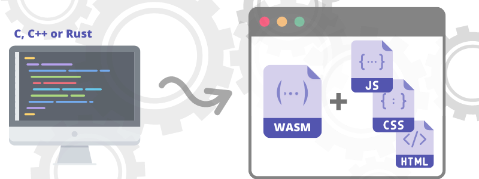

### What is WebAssembly?

WebAssembly is a binary instruction format for a stack-based virtual machine and usually abbreviated as WASM and it is designed as a portable target for compilation of high-level languages like C/C++/Rust, enabling deployment on the web for client and server applications.
 

Also in other words we can say that it is a compliment to JavaScript and a way for people to take C++, or C, or rust code,  or any other statically typed language and compile it down  to a module that you can call from JavaScript. So they work together.
